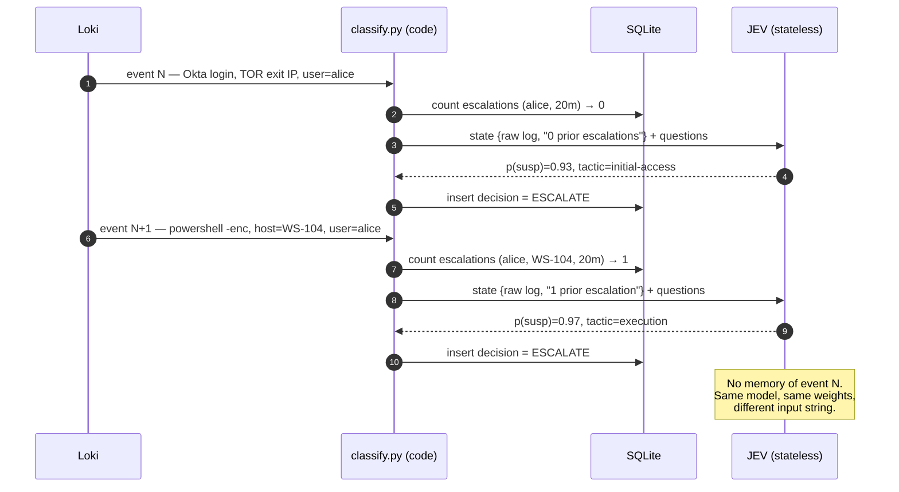
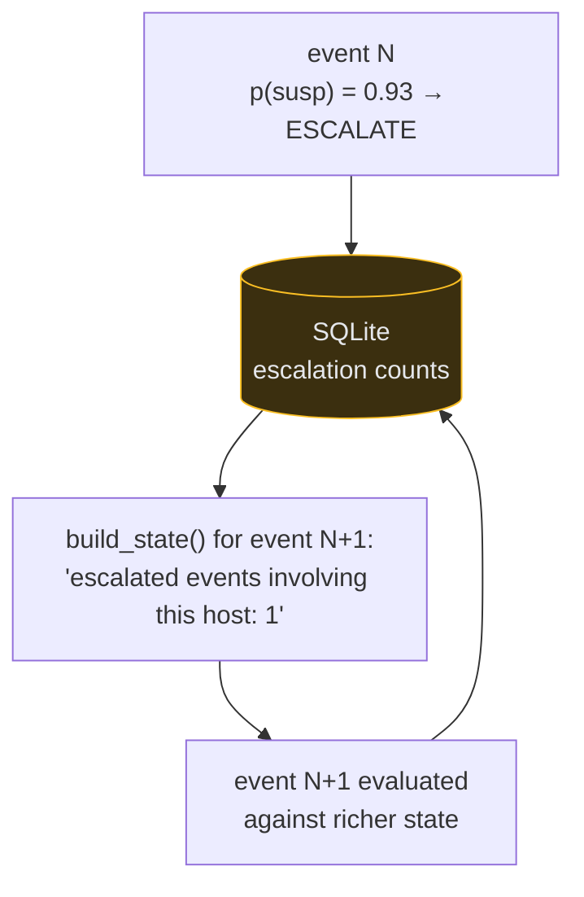

# The Memory Is in SQLite, Not the Model

Cross-event awareness comes from a feedback loop implemented in **code**:
past routing decisions are re-injected into future states. JEV never "sees"
the sequence — it sees a different state string.

**Design line:** deterministic context assembly in code → calibrated point
judgment from JEV → deliberative cross-event reasoning from the LLM (System 2).
Correlation across the full window is deliberately *not* JEV's job.
