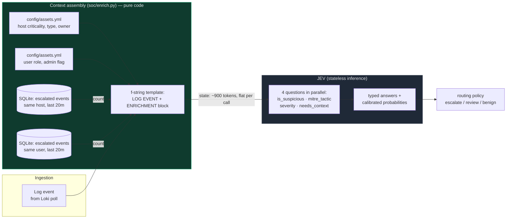

# Per-Event State Assembly (deterministic, no LLM)

Every JEV call is **stateless**. The "context" is constructed in code, from
scratch, for every event — YAML lookups, SQL queries, and string formatting.

**Key property:** JEV has no memory between calls. Event #10 and event #10,000
cost the same ~900 input tokens because there is no conversation to grow.
